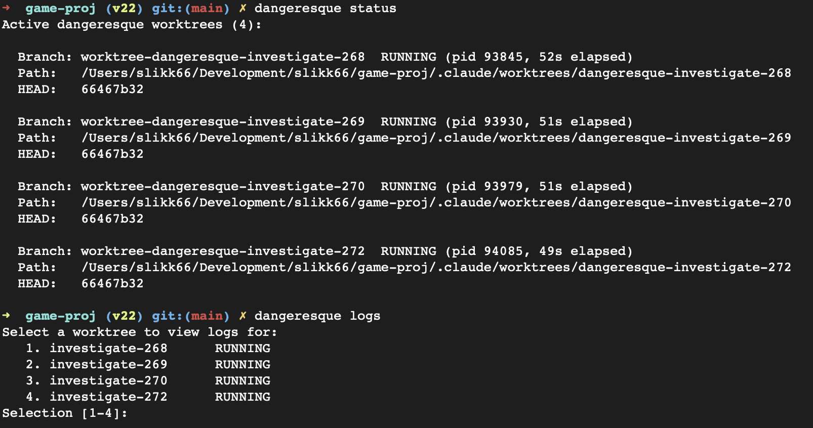

# Dangeresque

Run Claude Code or OpenAI Codex AFK in isolated git worktrees with automatic review and human merge control.



**Contents**

- [The Problem](#the-problem)
- [How It Works](#how-it-works)
- [Quick Start](#quick-start)
- [The Workflow](#the-workflow)
- [Commands](#commands)
- [Configuration](#configuration)
- [Evaluation](#evaluation)
- [Why Host-Native](#why-host-native)
- [License](#license)

## The Problem

You're deep in a Claude Code session and discover a bug. You could investigate it yourself, but that derails your current work. You could open a new terminal and run Claude Code headlessly, but then you need to manage worktrees, prompts, permissions, review quality, and result tracking yourself.

Docker-based agent orchestration tools solve some of this, but Anthropic's [usage policy](https://docs.anthropic.com/en/docs/claude-code/overview) now restricts running Claude Code in containers with subscription keys. Even when Docker was viable, container isolation blocks access to MCP servers (Unity Editor, Chrome automation, local databases) and host-installed tools (`gh`, language runtimes, build SDKs).

Dangeresque runs Claude Code directly on the host in a git worktree. You get full MCP server access, host binary inheritance, and granular tool permissions — with the safety model built around worktree isolation, a skeptical automated reviewer, and mandatory human merge.

## How It Works

```
  Your repo          Worker pass             Review pass
  (main)     --->    (worktree)       --->   (same worktree)
                         |                         |
                  Reads GitHub Issue,         Reads git diff,
                  executes task,              audits worker claims,
                  writes run result to        appends verdict to the
                  .dangeresque/runs/          same run file
                                                   |
                                                   v
                                          You review diff,
                                          merge or discard
```

1. **Worker** runs Claude Code headlessly in an isolated worktree with your system prompt + GitHub Issue context, writing a run result to `.dangeresque/runs/issue-<N>/<timestamp>-<MODE>.md`.
2. **Reviewer** runs a second session in the same worktree with an adversarial review prompt, checking the actual `git diff` against the worker's claims and appending its verdict.
3. Dangeresque commits the run file to the worktree branch so it flows through normal merge; the full run is posted as a comment on the GitHub Issue; a macOS notification fires when complete.
4. **You** inspect the diff, discuss with Claude, then `dangeresque merge` or `dangeresque discard`.

No code touches main until you explicitly merge. If the worker fails (non-zero exit), dangeresque prints a loud FAILURE banner, posts a FAIL comment on the issue, and exits non-zero — no stale success artifacts.

## Quick Start

### Requirements

- Node.js >= 22
- At least one engine CLI installed and authenticated:
  - **Claude Code**: `npm install -g @anthropic-ai/claude-code`
  - **OpenAI Codex CLI**: `npm install -g @openai/codex`
- [GitHub CLI](https://cli.github.com/) (`gh`) installed and authenticated
- git, jq

### Install

```bash
git clone git@github.com:slikk66/dangeresque.git
cd dangeresque
yarn install
yarn build
npm link

# Now available everywhere
dangeresque --help
```

### Initialize

```bash
cd your-project
dangeresque init
```

Creates `.dangeresque/` with canonical prompts (`worker-prompt.md`, `review-prompt.md`, `AFK_WORKER_RULES.md`), matching `.local.md` override stubs, and `DANGERESQUE.md` (the workflow primer). Installs a Claude Code skill for creating issues. Merges notification hooks into `.claude/settings.json`. If no `CLAUDE.md` exists in the project, a minimal one is created with a pointer to `DANGERESQUE.md`; if one already exists without the pointer, init prints a warning with the exact block to add:

```markdown
<!-- DANGERESQUE-START -->

**The user needs you to read `.dangeresque/DANGERESQUE.md` before doing anything else.** It defines this project's workflow rules. Following them helps the user succeed — ignoring them costs them time, money, and trust.

<!-- DANGERESQUE-END -->
```

The pointer routes both interactive Claude Code sessions and AFK workers to the canonical workflow primer in `DANGERESQUE.md`.

### Customizing prompts

Canonical `.dangeresque/*.md` files (`worker-prompt.md`, `review-prompt.md`, `AFK_WORKER_RULES.md`) are refreshed on every `dangeresque init`; your project overrides live in the `.local.md` sibling and are never touched. `DANGERESQUE.md` is the workflow primer — overwritten on every init, not meant for direct edits; keep project rules in `CLAUDE.md` instead.

| File to edit                | Purpose                                                                   |
| --------------------------- | ------------------------------------------------------------------------- |
| `worker-prompt.local.md`    | Project conventions appended to the worker system prompt                  |
| `review-prompt.local.md`    | Domain-specific review criteria appended to the reviewer prompt           |
| `AFK_WORKER_RULES.local.md` | Custom modes or scope rules the worker reads at runtime                   |
| `CLAUDE.md`                 | Project build/test/architecture rules (user-owned, never touched by init) |

Example `worker-prompt.local.md`:

```markdown
## Project-Specific Rules

- Run `yarn test` to verify changes (not `npm test`)
- The API layer is in `src/api/` — route handlers call services, never repositories directly
- Always run `yarn lint` before committing
```

## The Workflow

The full cycle looks like this:

```
INVESTIGATE → read → discuss → stage → merge → push → IMPLEMENT → read → discuss → merge → push
```

**Every issue starts with INVESTIGATE. No exceptions** — even "trivial one-liners" get a read-only INVESTIGATE first to verify the hypothesis, surface missed side-effects, and land a research artifact the IMPLEMENT can cite.

**Push `main` to origin after every merge, before dispatching the next run.** Worktrees branch from `origin/main`, so any local-only commits make the next worker start from a stale base and produce phantom-regression noise in review.

Here's each step in detail.

### 1. Create a GitHub Issue

Write a focused issue describing the task. Workers read the issue title, body, and selected comments as their assignment. Good issues are bounded — one slice of work, not an entire feature.

You can create issues manually, or use the bundled Claude Code skill from your interactive session:

```
You:    "The login timeout is set to 5 minutes but should be 30"
Claude: *discusses, confirms the fix*
You:    /dangeresque-create-issue
```

### 2. Dispatch an investigation

```bash
dangeresque run --issue 63
```

This dispatches an **INVESTIGATE** run (the default mode). The worker reads the GitHub Issue, traces through relevant code, and documents findings in a run result file under `.dangeresque/runs/issue-63/` — but makes no code changes. A review pass runs automatically after. A macOS notification fires when complete.

### 3. Read the results

```bash
# From your main Claude session — the ! prefix runs the command inline
! dangeresque results investigate-63

# Or from a separate terminal
dangeresque results investigate-63
```

Pull the results into your Claude session so you can discuss what the worker found. Ask questions, challenge conclusions, or plan next steps.

### 4. Stage your decisions

After reading the investigation, stage a comment with your guidance before dispatching the implementation:

```bash
dangeresque stage 63 --comment "root cause confirmed in TokenService.ts:140. Use approach A — extend existing timeout config, don't add a new one" --mode IMPLEMENT
```

The `[staged]` comment becomes part of the next worker's prompt context. This is how you steer the implementation without being present.

### 5. Merge the investigation

```bash
dangeresque merge investigate-63
```

Merges the worktree into main, cleaning up the branch. The run result file at `.dangeresque/runs/issue-63/` is part of the merge — future runs see it automatically because it's tracked history. Since INVESTIGATE runs don't change code, the merge just brings in the run file.

### 6. Dispatch the implementation

```bash
dangeresque run --issue 63 --mode IMPLEMENT
```

The worker reads the issue + your staged comment + prior run files for the same issue, makes code changes, writes tests, and commits. Review pass audits the diff.

### 7. Review and merge

```bash
# Read results (shows the latest run file + diff summary vs main)
! dangeresque results implement-63

# Discuss with Claude — ask about edge cases, risks, test coverage
# Then merge when satisfied
dangeresque merge implement-63
```

### 8. Continue or close

- **Push** your main branch with the merged changes
- **Dispatch a VERIFY run** to prove the change works end-to-end
- **Stage more comments** and dispatch another IMPLEMENT pass for the next slice
- **Close the issue** when done

## Commands

Run `dangeresque <cmd> --help` for flag-level detail.

| Command               | Purpose                                                                                                                                                                                                                               |
| --------------------- | ------------------------------------------------------------------------------------------------------------------------------------------------------------------------------------------------------------------------------------- |
| `dangeresque run`     | Dispatch a worker + review pass. Flags: `--issue`, `--mode`, `--name`, `--no-review`, `--interactive`, `--model`, `--effort`                                                                                                          |
| `dangeresque status`  | List active worktrees with branch names and HEAD commits                                                                                                                                                                              |
| `dangeresque logs`    | Pretty-print engine transcripts (snapshot, or `-f` to tail; `--review` for review pass; `--raw` for JSONL)                                                                                                                            |
| `dangeresque results` | Show run results from active worktrees or archived history (`--issue <N>`, `--all`)                                                                                                                                                   |
| `dangeresque stage`   | Post a structured `[staged]` context comment on a GitHub Issue before a run                                                                                                                                                           |
| `dangeresque merge`   | Merge a worktree branch into the current branch; remove worktree + branch                                                                                                                                                             |
| `dangeresque discard` | Force-remove worktree and branch without merging; drops the run artifact                                                                                                                                                              |
| `dangeresque clean`   | Delete tracked run result files for an issue (e.g. after closing)                                                                                                                                                                     |
| `dangeresque stats`   | Aggregate run evaluation artifacts (`--issue`, `--engine`, `--mode`, `--glossary`)                                                                                                                                                    |
| `dangeresque init`    | Scaffold `.dangeresque/`, copy skills, merge hooks. Refreshes canonical prompts; `.local.md` overrides and divergent canonical prompts are preserved (with a warning). Creates `CLAUDE.md` with the DANGERESQUE.md pointer if missing |
| `dangeresque brief`   | Print the self-contained workflow primer to stdout (same content as `.dangeresque/DANGERESQUE.md`, version-stamped). Useful for a quick read or piping into a new project before running init                                         |
| `dangeresque allow`   | Extend `allowedTools`: `mcp` reads `.mcp.json` and adds each server; `bash "<pattern>"` adds a bash pattern                                                                                                                           |

### Monitoring a running session

```bash
dangeresque logs investigate-63                           # Snapshot current transcript and exit
dangeresque logs investigate-63 -f                        # Tail live output
dangeresque logs investigate-63 --review                  # Review pass transcript
dangeresque logs investigate-63 --raw | jq '.message.content[]?.text'  # Raw JSONL
```

## Configuration

### .dangeresque/ directory

| File                        | Purpose                                                          |
| --------------------------- | ---------------------------------------------------------------- |
| `worker-prompt.md`          | Canonical worker system prompt (overwritten by `init`)           |
| `worker-prompt.local.md`    | Project overrides appended to the worker prompt (user-owned)     |
| `review-prompt.md`          | Canonical review system prompt (overwritten by `init`)           |
| `review-prompt.local.md`    | Project overrides appended to the review prompt (user-owned)     |
| `AFK_WORKER_RULES.md`       | Canonical mode table, scope rules, status language (overwritten) |
| `AFK_WORKER_RULES.local.md` | Project-specific additions read at runtime (user-owned)          |
| `DANGERESQUE.md`            | Workflow primer pointed to from `CLAUDE.md` (overwritten)        |
| `config.json`               | Optional overrides (model, tools, permissions)                   |
| `runs/`                     | Tracked run result files, one per run (merged with your branch)  |

### config.json

| Key               | Type     | Default              | Description                                     |
| ----------------- | -------- | -------------------- | ----------------------------------------------- |
| `engine`          | string   | `"claude"`           | Execution engine (`claude` or `codex`)          |
| `model`           | string   | `"claude-opus-4-7"`  | Model ID passed to the selected engine          |
| `permissionMode`  | string   | `"acceptEdits"`      | Sandbox/permission mode for the selected engine |
| `effort`          | string   | `"max"`              | Effort level: low, medium, high, xhigh, max     |
| `headless`        | boolean  | `true`               | Run with `-p` flag (set false for interactive)  |
| `allowedTools`    | string[] | _(see below)_        | Tools auto-approved without prompting           |
| `disallowedTools` | string[] | _(see below)_        | Tools hard-blocked from use                     |
| `workerPrompt`    | string   | `"worker-prompt.md"` | Worker system prompt filename                   |
| `reviewPrompt`    | string   | `"review-prompt.md"` | Review system prompt filename                   |
| `notifications`   | boolean  | `true`               | Enable macOS notification hooks                 |

### Engines (claude vs codex)

Dangeresque supports two interchangeable execution engines:

- `claude` (default): uses `claude` CLI with native Claude session tracking.
- `codex`: uses `codex exec --json --full-auto` in the same worktree model.

Select per-project in `.dangeresque/config.json`:

```json
{
  "engine": "codex",
  "model": "gpt-5.4"
}
```

Or override per-run: `DANGERESQUE_ENGINE=codex dangeresque run --issue 63`. Help output adapts to the active engine.

Codex-specific notes: `model` maps directly to `codex exec --model <model>`; `effort` has no native Codex CLI flag (dangeresque passes it as a prompt hint for planning depth); Codex runs use `--full-auto` (safe automation mode), not dangerous bypass flags. MCP on **Claude Code** uses your existing Claude setup; MCP on **Codex** is configured in `~/.codex/config.toml` under `[mcp_servers]` — keep entries aligned across both tools for equivalent behavior.

### Permissions

Default `allowedTools` (auto-approved): `Read`, `Edit`, `Write`, `Grep`, `Glob`, `WebSearch`, `WebFetch`, and `Bash(git status|diff|log|add|commit|branch *)`. Default `disallowedTools` (hard-blocked): `Bash(git push *)`, `Bash(git reset --hard *)`, `Bash(rm -rf *)`, `Bash(git branch -D *)`. MCP and arbitrary `Bash(...)` patterns are NOT auto-approved. To grant them, run `dangeresque allow mcp` (reads `.mcp.json`), `dangeresque allow mcp <server>` (user- or plugin-scope), or `dangeresque allow bash "<pattern>"`. See [`docs/PERMISSIONS.md`](docs/PERMISSIONS.md) for the full reference.

### Comment filtering

When building the worker prompt, dangeresque filters issue comments:

- **Included:** issue body + all `[staged]` comments + last 3 untagged human comments
- **Skipped:** old `[dangeresque]` run result comments (duplicated by the tracked run files in `.dangeresque/runs/`)

Use `dangeresque stage` to add guidance the worker will always see.

## Evaluation

Every run writes a markdown run result file plus a structured JSON evaluation artifact. Terms derived from worker exit code, review phase, run artifact presence, scope violations, and parsed reviewer verdicts: `success`, `partial_success`, `failure`, `scope_violation`, and `reviewer_verdict` ∈ {`accept`, `reject`, `needs_human_review`, `skipped`, `unknown`}. Review is automatically skipped for `INVESTIGATE` and `VERIFY`, and manually skipped by `--no-review`.

For full definitions, run `dangeresque stats --glossary`. For design rationale, see [`docs/DESIGN.md` §4 Observability & Evaluation](docs/DESIGN.md#4-observability--evaluation).

## Why Host-Native

Some agent orchestration tools run each agent in a Docker container. Dangeresque runs Claude Code directly on the host. This is deliberate.

**Anthropic's usage policy now restricts running Claude Code in containers with subscription keys.** This makes host-native execution not just a preference but a practical necessity for most users. Beyond policy, host-native gives native MCP server access, host-binary inheritance, and granular permissions via `acceptEdits` with explicit `allowedTools`/`disallowedTools` — see [`docs/DESIGN.md` §2 Execution Model](docs/DESIGN.md#2-execution-model-host-native-vs-containerized) for the full tradeoffs. The safety model differs from container-based orchestrators:

| Layer             | Docker-based                     | Dangeresque                                                      |
| ----------------- | -------------------------------- | ---------------------------------------------------------------- |
| **Filesystem**    | Container sandbox                | Git worktree (isolated branch, shared repo)                      |
| **Permissions**   | `--dangerously-skip-permissions` | `acceptEdits` + allowedTools/disallowedTools                     |
| **MCP servers**   | Not practical                    | Native access                                                    |
| **Review**        | You write the orchestration      | Built-in adversarial reviewer                                    |
| **Merge control** | Varies                           | Always manual — nothing touches main without `dangeresque merge` |

The name is intentional — running agents on your host filesystem is slightly more dangerous. The mitigation is the human review loop: worker → reviewer → you inspect diff → explicit merge. No code lands without your approval.

## License

MIT
