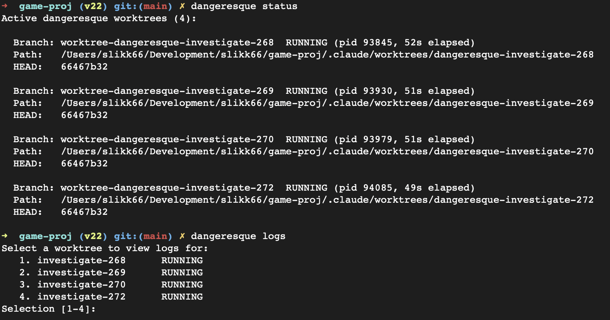

# Dangeresque

Run Claude Code or OpenAI Codex AFK in isolated git worktrees with structured multi-phase passes, automatic adversarial review, and human merge control.



**Contents**

- [The Problem](#the-problem)
- [How It Works](#how-it-works)
- [Quick Start](#quick-start)
- [The Workflow](#the-workflow)
- [Scope](#scope)
- [Opportunistic Drive-by Fixes](#opportunistic-drive-by-fixes)
- [Commands](#commands)
- [Configuration](#configuration)
- [Health Checks (`dangeresque doctor`)](#health-checks-dangeresque-doctor)
- [Schema Migration (`dangeresque migrate`)](#schema-migration-dangeresque-migrate)
- [Schema Versioning Model](#schema-versioning-model)
- [Evaluation](#evaluation)
- [Why Host-Native](#why-host-native)
- [License](#license)

## The Problem

You're deep in a Claude Code session and discover a bug. You could investigate it yourself, but that derails your current work. You could open a new terminal and run Claude Code headlessly, but then you need to manage worktrees, prompts, permissions, review quality, and result tracking yourself.

Docker-based agent orchestration tools solve some of this, but Anthropic's [usage policy](https://docs.anthropic.com/en/docs/claude-code/overview) now restricts running Claude Code in containers with subscription keys. Even when Docker was viable, container isolation blocks access to MCP servers (Unity Editor, Chrome automation, local databases) and host-installed tools (`gh`, language runtimes, build SDKs).

Dangeresque runs Claude Code directly on the host in a git worktree. You get full MCP server access, host binary inheritance, and granular tool permissions — with the safety model built around worktree isolation, a skeptical automated reviewer, and mandatory human merge.

## How It Works

```
  Your repo          Worker pass             Verify hook       Review pass
  (main)     --->    (worktree)       --->   (worktree) --->   (same worktree)
                         |                       |                   |
                  Reads GitHub Issue,       Compile/test/lint,  Reads git diff,
                  executes task,            block-on-failure    audits worker claims,
                  writes run result to      writes results      appends verdict to
                  gitignored                into SUMMARY +      the same run file
                  .dangeresque/runs/        ## Verification           |
                                                                      v
                                                            On merge: artifact
                                                            mirrored to main
                                                            checkout; SUMMARY +
                                                            path posted to issue
                                                                      |
                                                                      v
                                                            You review diff,
                                                            merge or discard
```

1. **Worker** runs Claude Code headlessly in an isolated worktree with your system prompt + GitHub Issue context, writing a run result to `.dangeresque/runs/issue-<N>/<timestamp>-<MODE>.md`. The runs directory is **gitignored** — artifacts never enter git history.
2. **Verify hook** (optional, configured per project) runs compile/test/lint commands in the worktree post-rebase, pre-review. Block-style failures skip the review pass and fail the run; results land in the artifact's `<!-- SUMMARY -->` block (`Verify:` line) and a `## Verification` body section.
3. **Reviewer** runs a second session in the same worktree with an adversarial review prompt, checking the actual `git diff` against the worker's claims and appending its verdict to the run file.
4. **Comment on the issue** carries only the artifact's `<!-- SUMMARY -->` block plus the local path — never the full body. The artifact stays on disk so collaborators read it via `dangeresque results --issue <N>` or directly at `.dangeresque/runs/issue-<N>/`.
5. **On `dangeresque merge`**, the gitignored artifact is mirrored from the worktree back to the project root before the worktree is torn down. On the next dispatch for the same issue, prior artifacts are mirrored _into_ the new worktree so the worker can read them.
6. **You** inspect the diff, discuss with Claude, then `dangeresque merge` or `dangeresque discard`.

No code touches main until you explicitly merge. If the worker fails (non-zero exit), dangeresque prints a loud FAILURE banner, posts a FAIL comment on the issue, and exits non-zero — no stale success artifacts.

> **Migrating from an older dangeresque (artifacts tracked in git)?** Run once per repo: `git rm --cached -r .dangeresque/runs/`, commit, push. Files stay on disk; subsequent runs use the mirror flow above. `dangeresque init` adds `.dangeresque/runs/` to your `.gitignore` automatically.

## Quick Start

### Requirements

- Node.js >= 22
- At least one engine CLI installed and authenticated:
  - **Claude Code**: `npm install -g @anthropic-ai/claude-code`
  - **OpenAI Codex CLI**: `npm install -g @openai/codex`
- [GitHub CLI](https://cli.github.com/) (`gh`) installed and authenticated
- git, jq

### Install

```bash
git clone git@github.com:slikk66/dangeresque.git
cd dangeresque
yarn install
yarn build
npm link

# Now available everywhere
dangeresque --help
```

### Initialize

```bash
cd your-project
dangeresque init
```

Creates `.dangeresque/` with canonical prompts (`worker-prompt.md`, `review-prompt.md`, `AFK_WORKER_RULES.md`), matching `.local.md` override stubs, and `DANGERESQUE.md` (the workflow primer). Installs a Claude Code skill for creating issues. Merges notification hooks into `.claude/settings.json`. If no `CLAUDE.md` exists in the project, a minimal one is created with a pointer to `DANGERESQUE.md`; if one already exists without the pointer, init prints a warning with the exact block to add:

```markdown
<!-- DANGERESQUE-START -->

**`dangeresque` is installed in this repo.** Use it — not raw `git worktree`, `kill <pid>`, or `cd <worktree>` — to dispatch AFK AI workers, manage isolated worktrees, and gate merges. Before dispatching or merging, run **`dangeresque brief`** (workflow loop + the hard rule). Run **`dangeresque --help`** for the full command surface (auto-generated, never stale).

<!-- DANGERESQUE-END -->
```

The pointer routes both interactive Claude Code sessions and AFK workers to the canonical workflow primer in `DANGERESQUE.md`.

Confirm the install with `dangeresque doctor` — it checks that `gh` is on PATH, the binary's `dist/` matches HEAD, the artifact schema version is current, and `.dangeresque/` is initialized in the project. See [Health Checks](#health-checks-dangeresque-doctor) below for the full output shape.

### Customizing prompts

Canonical `.dangeresque/*.md` files (`worker-prompt.md`, `review-prompt.md`, `AFK_WORKER_RULES.md`) are refreshed on every `dangeresque init`; your project overrides live in the `.local.md` sibling and are never touched. `DANGERESQUE.md` is the workflow primer — overwritten on every init, not meant for direct edits; keep project rules in `CLAUDE.md` instead.

| File to edit                | Purpose                                                                   |
| --------------------------- | ------------------------------------------------------------------------- |
| `worker-prompt.local.md`    | Project conventions appended to the worker system prompt                  |
| `review-prompt.local.md`    | Domain-specific review criteria appended to the reviewer prompt           |
| `AFK_WORKER_RULES.local.md` | Custom modes or scope rules the worker reads at runtime                   |
| `CLAUDE.md`                 | Project build/test/architecture rules (user-owned, never touched by init) |

Example `worker-prompt.local.md`:

```markdown
## Project-Specific Rules

- Run `yarn test` to verify changes (not `npm test`)
- The API layer is in `src/api/` — route handlers call services, never repositories directly
- Always run `yarn lint` before committing
```

## The Workflow

The full cycle looks like this:

```
INVESTIGATE → read → discuss → stage → merge → push → IMPLEMENT → read → discuss → merge → push
```

**Every issue starts with INVESTIGATE. No exceptions** — even "trivial one-liners" get a read-only INVESTIGATE first to verify the hypothesis, surface missed side-effects, and land a research artifact the IMPLEMENT can cite.

**Push `main` to origin after every merge, before dispatching the next run.** Worktrees branch from `origin/main`, so any local-only commits make the next worker start from a stale base and produce phantom-regression noise in review.

Here's each step in detail.

### 1. Create a GitHub Issue

Write a focused issue describing the task. Workers read the issue title, body, and selected comments as their assignment. Good issues are bounded — one slice of work, not an entire feature.

Optionally include a fenced ` ```dangeresque-scope ``` ` YAML block in the body (or any `[staged]` comment) to declare an allow/deny list of file globs the worker is expected to touch. The reviewer applies category-specific scrutiny based on what fell inside, outside, or extended the declared scope. See [Scope](#scope) for syntax.

You can create issues manually, or use the bundled Claude Code skill from your interactive session:

```
You:    "The login timeout is set to 5 minutes but should be 30"
Claude: *discusses, confirms the fix*
You:    /dangeresque-create-issue
```

### 2. Dispatch an investigation

```bash
dangeresque run --issue 63
```

This dispatches an **INVESTIGATE** run (the default mode). The worker reads the GitHub Issue, traces through relevant code, and documents findings in a run result file under `.dangeresque/runs/issue-63/` — but makes no code changes. A review pass runs automatically after. A macOS notification fires when complete.

### 3. Read the results

```bash
# From your main Claude session — the ! prefix runs the command inline
! dangeresque results investigate-63

# Or from a separate terminal
dangeresque results investigate-63
```

Pull the results into your Claude session so you can discuss what the worker found. Ask questions, challenge conclusions, or plan next steps.

### 4. Stage your decisions

After reading the investigation, stage a comment with your guidance before dispatching the implementation:

```bash
dangeresque stage 63 --comment "root cause confirmed in TokenService.ts:140. Use approach A — extend existing timeout config, don't add a new one" --mode IMPLEMENT
```

The `[staged]` comment becomes part of the next worker's prompt context. This is how you steer the implementation without being present.

### 5. Merge the investigation

```bash
dangeresque merge investigate-63
```

Merges the worktree into main and cleans up the branch. The run result file at `.dangeresque/runs/issue-63/` is **gitignored** — it does not flow through `git merge`. Instead, dangeresque mirrors it from the worktree to the project root just before tearing the worktree down, and mirrors prior artifacts back into the next worktree on dispatch. Since INVESTIGATE runs don't change code, `git merge` is a no-op (HEAD unchanged) and only the artifact mirror runs.

### 6. Dispatch the implementation

```bash
dangeresque run --issue 63 --mode IMPLEMENT
```

The worker reads the issue + your staged comment + prior run files for the same issue, makes code changes, writes tests, and commits. Review pass audits the diff.

### 7. Review and merge

```bash
# Read results (shows the latest run file + diff summary vs main)
! dangeresque results implement-63

# Discuss with Claude — ask about edge cases, risks, test coverage
# Then merge when satisfied
dangeresque merge implement-63
```

### 8. Continue or close

- **Push** your main branch with the merged changes
- **Dispatch a VERIFY run** to prove the change works end-to-end
- **Stage more comments** and dispatch another IMPLEMENT pass for the next slice
- **Close the issue** when done

## Scope

Two complementary mechanisms bound what files a worker is allowed to touch: a **declared scope block** in the issue (operator-side allow/deny globs) and a **scope declaration** the worker writes into its run result (per-file category + rationale). Dangeresque classifies every changed file against both and stamps the result on the artifact for the reviewer.

### Declared scope block (issue side)

Add a fenced ` ```dangeresque-scope ``` ` YAML block to the issue body or any `[staged]` comment. Multiple blocks across body + staged comments are unioned; deny wins on conflict.

````markdown
## Goal

Bump the auth timeout default from 5 minutes to 30.

```dangeresque-scope
allow:
  - src/auth/timeout.ts
  - src/auth/timeout.test.ts
deny:
  - src/auth/secrets.ts
```
````

`allow:` and `deny:` are lists of glob patterns evaluated by Node's `node:path.matchesGlob` (Node 22+). `#` line comments and blank lines inside the block are tolerated; quoted values have their quotes stripped. Empty `allow:` means "no operator-side allow-list" (the worker's `## Scope Declaration` becomes the sole signal); empty `deny:` means no project-level no-fly list at the issue level.

### Scope Declaration (worker side)

For `IMPLEMENT`, `REFACTOR`, and `TEST` modes the worker is required to add a top-level `## Scope Declaration` section to its run result file listing every file it touched, with one of four categories and a rationale. Bullet form and table form are both accepted (mix freely).

```markdown
## Scope Declaration

- `src/auth/timeout.ts` (declared) — implements the Goal's primary entry point
- `src/auth/timeout.test.ts` (declared) — covers the new branch
- `src/auth/util.ts` (extension) — added helper required by timeout.ts
- `yarn.lock` (incidental) — touched by yarn install
```

| Category | Meaning |
| --- | --- |
| `declared` | The issue's allow-list explicitly named or globbed this file. Primary in-scope changes. |
| `extension` | Not in the allow-list, but required to complete the Goal (a helper a new function depends on). Justify why. |
| `opportunistic` | Drive-by edit unrelated to the Goal (typo fix, lint cleanup). Should be rare; bounded by the project budget below. |
| `incidental` | Auto-generated or auto-touched (`yarn.lock`, build outputs, formatter changes). |

### Classifier output

After the worker exits, dangeresque computes a `scope_report` of every changed file (from `git diff` against the worktree base) into one of three buckets:

- `in_scope` — matched an allow-glob, OR was declared `declared` / `incidental` by the worker.
- `extended` — the worker declared it `extension` or `opportunistic` (subject to the budget below).
- `outside` — matched no allow-glob, was not declared, OR was demoted from `extended` by a project denyGlob or the opportunistic budget.

The report lands on the artifact JSON as `scope_report` (alongside the parsed `scope_block` and the `scope_declaration` array) and the reviewer reads it to apply category-specific scrutiny: `declared` reviewed on correctness only, `extension` on necessity AND correctness, `opportunistic` REJECT unless strictly trivial, `outside` REJECT unless justified.

The reviewer is the authority on scope when it ran. When review is skipped (INVESTIGATE/VERIFY/`--no-review`), `outside` entries contribute the `scope_outside` failure category and the run is marked `partial_success` — see [Evaluation](#evaluation).

## Opportunistic Drive-by Fixes

Most agent orchestrators choose one of two scope postures: **stay strictly in lane** (any change outside the declared files is a violation) or **free-for-all** (the worker decides). Dangeresque sits between them with a **bounded opportunistic budget** — small drive-by fixes are allowed but capped, the worker tags them as such, and the reviewer scrutinizes them harder than declared changes.

Configured per project under `scope.opportunistic` in `.dangeresque/config.json`:

| Key | Default | Purpose |
| --- | --- | --- |
| `enabled` | `true` | When false, skip the file/line passes (denyGlobs still apply — security policy is unconditional). |
| `maxFiles` | `1` | At most this many `opportunistic` files. Excess demoted to `outside`, trailing-first by declaration order. |
| `maxLines` | `20` | Sum of (added + deleted) lines across remaining `opportunistic` files. Excess demoted largest-first. |
| `denyGlobs` | `["infra/**", ".github/**", "**/*.lock", "**/migrations/**", "**/.env*", "**/secrets/**"]` | Project-level no-fly zones. Demote both `extension` and `opportunistic` matches to `outside`. |

Three enforcement passes run in order: project denyGlobs → `maxFiles` cap → `maxLines` cap. A demoted file moves from `extended` to `outside` in the `scope_report`, where the reviewer adjudicates it.

Example `config.json`:

```json
{
  "scope": {
    "opportunistic": {
      "enabled": true,
      "maxFiles": 1,
      "maxLines": 20,
      "denyGlobs": [
        "infra/**",
        ".github/**",
        "**/*.lock",
        "**/migrations/**",
        "**/.env*",
        "**/secrets/**"
      ]
    }
  }
}
```

To disable budget enforcement entirely while keeping the security denyGlobs, set `enabled: false` and leave `denyGlobs` populated. To allow unlimited drive-bys (not recommended), set `maxFiles` and `maxLines` to large values; the reviewer's per-category scrutiny still applies.

## Commands

Run `dangeresque <cmd> --help` for flag-level detail.

| Command               | Purpose                                                                                                                                                                                                                               |
| --------------------- | ------------------------------------------------------------------------------------------------------------------------------------------------------------------------------------------------------------------------------------- |
| `dangeresque run`     | Dispatch a worker + review pass. Flags: `--issue`, `--mode`, `--name`, `--no-review`, `--no-verify`, `--interactive`, `--model`, `--effort`                                                                                           |
| `dangeresque status`  | List active worktrees with branch names and HEAD commits                                                                                                                                                                              |
| `dangeresque logs`    | Pretty-print engine transcripts (snapshot, or `-f` to tail; `--review` for review pass; `--raw` for JSONL)                                                                                                                            |
| `dangeresque results` | Show run results from active worktrees or archived history (`--issue <N>`, `--all`)                                                                                                                                                   |
| `dangeresque stage`   | Post a structured `[staged]` context comment on a GitHub Issue before a run                                                                                                                                                           |
| `dangeresque merge`   | Merge a worktree branch into the current branch; remove worktree + branch. **Keeps the run report** — mirrored from the worktree to `.dangeresque/runs/` before teardown                                                              |
| `dangeresque discard` | Remove worktree and branch without merging; **deletes the run report along with the worktree**. `--force` first stops a running worker                                                                                                |
| `dangeresque stop`    | Stop a running worker cleanly (parent CLI + engine child); leaves the worktree intact. Use this — never raw `kill <pid>`                                                                                                              |
| `dangeresque clean`   | Delete on-disk run result files for an issue (e.g. after closing). Files are gitignored — clean is a local-disk operation, not a git operation                                                                                        |
| `dangeresque stats`   | Aggregate run evaluation artifacts (`--issue`, `--engine`, `--mode`, `--glossary`)                                                                                                                                                    |
| `dangeresque init`    | Scaffold `.dangeresque/`, copy skills, merge hooks. Refreshes canonical prompts; `.local.md` overrides and divergent canonical prompts are preserved (with a warning). Creates `CLAUDE.md` with the DANGERESQUE.md pointer if missing |
| `dangeresque migrate` | Walk `.dangeresque/runs/issue-*/*.json` and rewrite each artifact to the current `ARTIFACT_SCHEMA_VERSION`. Idempotent — already-current files are skipped. See [Schema Migration](#schema-migration-dangeresque-migrate)              |
| `dangeresque doctor`  | Health-check the install: `dist/build-info.json` present, `dist/` matches HEAD, schema-version current, `gh` on PATH, `.dangeresque/` initialized. `--strict` exits non-zero on warnings (CI-friendly). See [Health Checks](#health-checks-dangeresque-doctor) |
| `dangeresque brief`   | Print the self-contained workflow primer to stdout (same content as `.dangeresque/DANGERESQUE.md`, version-stamped). Useful for a quick read or piping into a new project before running init                                         |
| `dangeresque allow`   | Extend `allowedTools`: `mcp` reads `.mcp.json` and adds each server; `bash "<pattern>"` adds a bash pattern                                                                                                                           |

### Monitoring a running session

```bash
dangeresque status                                        # List active worktrees + worker liveness
dangeresque logs investigate-63                           # Snapshot current transcript and exit
dangeresque logs investigate-63 -f                        # Tail live output
dangeresque logs investigate-63 --review                  # Review pass transcript
dangeresque logs investigate-63 --raw | jq '.message.content[]?.text'  # Raw JSONL
dangeresque stop investigate-63                           # Stop a runaway worker (don't `kill <pid>`)
```

## Configuration

### .dangeresque/ directory

| File                        | Purpose                                                                                                           |
| --------------------------- | ----------------------------------------------------------------------------------------------------------------- |
| `worker-prompt.md`          | Canonical worker system prompt (overwritten by `init`)                                                            |
| `worker-prompt.local.md`    | Project overrides appended to the worker prompt (user-owned)                                                      |
| `review-prompt.md`          | Canonical review system prompt (overwritten by `init`)                                                            |
| `review-prompt.local.md`    | Project overrides appended to the review prompt (user-owned)                                                      |
| `AFK_WORKER_RULES.md`       | Canonical mode table, scope rules, status language (overwritten)                                                  |
| `AFK_WORKER_RULES.local.md` | Project-specific additions read at runtime (user-owned)                                                           |
| `DANGERESQUE.md`            | Workflow primer pointed to from `CLAUDE.md` (overwritten)                                                         |
| `config.json`               | Optional overrides (model, tools, permissions)                                                                    |
| `runs/`                     | Run result files (one per run). **Gitignored** — mirrored across worktrees by the CLI, not carried by `git merge` |

### config.json

| Key               | Type     | Default              | Description                                                                                        |
| ----------------- | -------- | -------------------- | -------------------------------------------------------------------------------------------------- |
| `engine`          | string   | `"claude"`           | Execution engine (`claude` or `codex`)                                                             |
| `model`           | string   | `"claude-opus-4-7"`  | Model ID passed to the selected engine                                                             |
| `permissionMode`  | string   | `"acceptEdits"`      | Sandbox/permission mode for the selected engine                                                    |
| `effort`          | string   | `"max"`              | Effort level: low, medium, high, xhigh, max                                                        |
| `headless`        | boolean  | `true`               | Run with `-p` flag (set false for interactive)                                                     |
| `allowedTools`    | string[] | _(see below)_        | Tools auto-approved without prompting                                                              |
| `disallowedTools` | string[] | _(see below)_        | Tools hard-blocked from use                                                                        |
| `workerPrompt`    | string   | `"worker-prompt.md"` | Worker system prompt filename                                                                      |
| `reviewPrompt`    | string   | `"review-prompt.md"` | Review system prompt filename                                                                      |
| `notifications`   | boolean  | `true`               | Enable macOS notification hooks                                                                    |
| `verify`          | object   | _(empty commands)_   | Pre-review verification hook — see the [Verification](#verification-pre-review-hook) section below |
| `scope`           | object   | _(see Opportunistic)_ | Scope subsystem policy. `scope.opportunistic` controls the per-project drive-by budget — see [Opportunistic Drive-by Fixes](#opportunistic-drive-by-fixes) |

### Engines (claude vs codex)

Dangeresque supports two interchangeable execution engines:

- `claude` (default): uses `claude` CLI with native Claude session tracking.
- `codex`: uses `codex exec --json --full-auto` in the same worktree model.

Select per-project in `.dangeresque/config.json`:

```json
{
  "engine": "codex",
  "model": "gpt-5.4"
}
```

Or override per-run: `DANGERESQUE_ENGINE=codex dangeresque run --issue 63`. Help output adapts to the active engine.

Codex-specific notes: `model` maps directly to `codex exec --model <model>`; `effort` has no native Codex CLI flag (dangeresque passes it as a prompt hint for planning depth); Codex runs use `--full-auto` (safe automation mode), not dangerous bypass flags. MCP on **Claude Code** uses your existing Claude setup; MCP on **Codex** is configured in `~/.codex/config.toml` under `[mcp_servers]` — keep entries aligned across both tools for equivalent behavior.

### Permissions

Default `allowedTools` (auto-approved): `Read`, `Edit`, `Write`, `Grep`, `Glob`, `WebSearch`, `WebFetch`, and `Bash(git status|diff|log|add|commit|branch *)`. Default `disallowedTools` (hard-blocked): `Bash(git push *)`, `Bash(git reset --hard *)`, `Bash(rm -rf *)`, `Bash(git branch -D *)`. MCP and arbitrary `Bash(...)` patterns are NOT auto-approved. To grant them, run `dangeresque allow mcp` (reads `.mcp.json`), `dangeresque allow mcp <server>` (user- or plugin-scope), or `dangeresque allow bash "<pattern>"`. See [`docs/PERMISSIONS.md`](docs/PERMISSIONS.md) for the full reference.

### Comment filtering

When building the worker prompt, dangeresque filters issue comments:

- **Included:** issue body + all `[staged]` comments + last 3 untagged human comments
- **Skipped:** prior `[dangeresque]` run-summary comments (the worker reads the local artifacts from `.dangeresque/runs/issue-<N>/` instead — they hold the full body, the comment carries only the SUMMARY block)

Use `dangeresque stage` to add guidance the worker will always see.

### GitHub issue comments

After each run, dangeresque posts a single comment on the issue containing only the artifact's `<!-- SUMMARY -->` block, the local artifact path, and a pointer to `dangeresque results --issue <N>`. The full run-result body never leaves the local machine — it lives at `.dangeresque/runs/issue-<N>/<timestamp>-<MODE>.md` (gitignored) on the host that ran the worker. Pull it onto another machine via `git`-based mirroring of your choice, or run dangeresque on the same host where the artifacts already live.

### Verification (pre-review hook)

Dangeresque can run compile/test/lint commands in the worktree between the worker exit (post-rebase, post-file-count-normalize) and the review pass. This catches drift between worker prose claims ("yarn build passes") and code reality. The reviewer (text-only) treats verification exit codes as ground truth and overrides any contradicting worker claim.

Configure under `verify` in `.dangeresque/config.json`. See [`config-templates/config.example.json`](config-templates/config.example.json) for the full shape and ecosystem-specific examples (Cargo, Go, TypeScript-only). Minimal example:

```json
{
  "verify": {
    "enabled": true,
    "modes": ["IMPLEMENT", "REFACTOR", "TEST", "VERIFY"],
    "commands": [
      {
        "name": "compile",
        "cmd": "yarn build",
        "on_failure": "block",
        "timeout_ms": 300000
      },
      {
        "name": "test",
        "cmd": "yarn test",
        "on_failure": "block",
        "timeout_ms": 600000
      },
      {
        "name": "lint",
        "cmd": "yarn lint",
        "on_failure": "warn",
        "timeout_ms": 120000
      }
    ]
  }
}
```

Per-command policy:

- `on_failure: "block"` — first failure short-circuits the run, skips the review pass, marks `result: "failure"` with `failure_categories: ["verification_failed"]`.
- `on_failure: "warn"` — failure is recorded but the review still runs.

The CLI runs verification commands directly — `allowedTools` does not constrain them, since the engine never sees them.

Where output lands:

- **Artifact JSON** (`<timestamp>-<MODE>.json`) — `verification: VerificationResult[]` with name, cmd, exit code, duration, stdout/stderr excerpts, `timed_out`, and `truncated` flags.
- **Artifact Markdown** — a `Verify: …` line in the `<!-- SUMMARY -->` block, plus a `## Verification (pre-review, captured automatically)` body section with a one-line PASS/FAIL/TIMEOUT per command and the trailing stderr excerpt for any non-zero exit.
- **Console** — per-command pass/warn/block lines while the hook runs.

Operator escape hatches:

- `dangeresque run --issue <N> --no-verify` — skip for one run.
- `verify.enabled: false` in config — disable globally.
- Drop the offending command from `commands`.

Empty `commands` array (the default) means no-op; opt in by listing commands.

## Health Checks (`dangeresque doctor`)

`dangeresque doctor` runs five quick checks against the installed binary, the project, and the host environment. It exists because a globally-linked `dangeresque` is easy to forget about: a stale `dist/` writes wrong-schema artifacts, a missing `gh` makes `--issue` runs fail mid-flight, and a project that was never `init`-ed has no `.dangeresque/` for the worker to read.

```
$ dangeresque doctor
dangeresque doctor
  package root: /path/to/dangeresque
  project root: /path/to/your-project

Checks:
  [PASS] build-info-present
         commit=e30165fb built_at=2026-05-03T05:54:59.021Z schema=6
  [PASS] dist-matches-head
         dist matches HEAD (e30165fb)
  [PASS] schema-version
         schema_version=6
  [PASS] gh-cli-available
         gh --version OK
  [PASS] dangeresque-initialized
         .dangeresque/ exists at /path/to/your-project

Summary: 5 pass · 0 warn · 0 fail

Exit codes: 0 normal · 1 if --strict and any WARN · 2 on internal error
```

| Check | What it verifies |
| --- | --- |
| `build-info-present` | `dist/build-info.json` was emitted by `yarn build`. Without it, drift detection cannot run. |
| `dist-matches-head` | The compiled `dist/` was built from the current git `HEAD` of the package. WARN on drift. |
| `schema-version` | The build-info `schema_version` matches the loaded module's `ARTIFACT_SCHEMA_VERSION`. Catches mixed-build state. |
| `gh-cli-available` | `gh --version` succeeds. The `--issue <N>` flow requires it. |
| `dangeresque-initialized` | `.dangeresque/` exists in the project root. Catches "linked the binary but never ran `dangeresque init`". |

`--strict` flips WARN into an exit-code-1 condition for CI use. By default only FAIL produces non-zero exit. Internal errors (uncaught exceptions in the doctor checks themselves) exit 2.

`dangeresque run` and `dangeresque migrate` also auto-print a stale-binary banner at the top of stdout when `dist/build-info.json` does not match HEAD — read-only commands skip the banner to keep their output pipe-friendly. The banner points at `dangeresque doctor` for full diagnosis.

## Schema Migration (`dangeresque migrate`)

`dangeresque migrate` walks `.dangeresque/runs/issue-*/` and rewrites every `*.json` artifact in place to the current `ARTIFACT_SCHEMA_VERSION`. Idempotent — files already at the current version are skipped, not rewritten.

```
$ dangeresque migrate
Migrated: 0
Skipped (already at v6): 1
```

Currently supported source versions: `v4` and `v5`. Older versions throw with a "unsupported source schema_version" error and require manual handling.

| Step | Effect |
| --- | --- |
| `v4 → v5` | Adds empty defaults for `scope_block`, `scope_declaration`, `scope_report` (the scope subsystem fields). |
| `v5 → v6` | Drops the deprecated `scope_violations` field; renames the `scope_violation` enum value in `failure_categories` to `scope_outside`. |

Migrations write a `migrated_from_version` field on each touched artifact so downstream consumers can tell a freshly-migrated file from one originally written at the current version. Run-result `.md` files are untouched — they are operator narrative, not derived data.

Why this exists: schema-version bumps happen in service of the artifact format evolving (new fields, renamed enums, dropped legacy shapes). Old artifacts on disk should not block adopting a newer binary, and the human reading `.dangeresque/runs/` should not have to mentally diff two schemas. See [Schema Versioning Model](#schema-versioning-model) below.

## Schema Versioning Model

Dangeresque is pre-1.0 and runs a **break-and-migrate** posture on its artifact schema: when the artifact format needs to change, `ARTIFACT_SCHEMA_VERSION` bumps, the `dist/build-info.json` records the new version, and `dangeresque migrate` rewrites old artifacts on disk. Downstream consumers branch on `schema_version`.

The same posture applies to the CLI surface and prompt templates — `dangeresque init` overwrites canonical templates on every run; project-specific overrides live in the `.local.md` siblings and survive. There is no in-place upgrade ceremony or version negotiation; the design favors a clean current shape over a backwards-compatible accumulation.

Operator playbook for stale binary state:

```bash
# Inside the dangeresque package checkout
yarn build
dangeresque doctor   # confirms dist matches HEAD and schema is current
```

Operator playbook for old artifacts after upgrading:

```bash
# Inside any project that uses dangeresque
dangeresque migrate
```

`dist/build-info.json` records `{commit, built_at, schema_version}` on every `yarn build`. The `dist-matches-head` and `schema-version` doctor checks read it; `dangeresque run` and `dangeresque migrate` read it via `detectDrift()` and emit a stale-binary banner when needed. The system is self-describing — a worker that crashes mid-run leaves an artifact stamped with the schema version it understood, so a later `dangeresque migrate` can decide what to do with it.

## Evaluation

Every run writes a markdown run result file plus a structured JSON evaluation artifact. Terms derived from worker exit code, review phase, run artifact presence, scope classification (`scope_report.outside`), verification outcomes, and parsed reviewer verdicts: `success`, `partial_success`, `failure`, `scope_outside`, `verification_failed`, and `reviewer_verdict` ∈ {`accept`, `reject`, `needs_human_review`, `skipped`, `unknown`}. Review is automatically skipped for `INVESTIGATE`/`VERIFY`, when verification blocks (a `block`-policy command failed), and manually skipped by `--no-review`. The `scope_outside` failure category is emitted only when review was skipped — when review ran, the reviewer verdict controls the result (see [Scope](#scope)).

For full definitions, run `dangeresque stats --glossary`. For design rationale, see [`docs/DESIGN.md` §4 Observability & Evaluation](docs/DESIGN.md#4-observability--evaluation).

## Why Host-Native

Some agent orchestration tools run each agent in a Docker container. Dangeresque runs Claude Code directly on the host. This is deliberate.

**Anthropic's usage policy now restricts running Claude Code in containers with subscription keys.** This makes host-native execution not just a preference but a practical necessity for most users. Beyond policy, host-native gives native MCP server access, host-binary inheritance, and granular permissions via `acceptEdits` with explicit `allowedTools`/`disallowedTools` — see [`docs/DESIGN.md` §2 Execution Model](docs/DESIGN.md#2-execution-model-host-native-vs-containerized) for the full tradeoffs. The safety model differs from container-based orchestrators:

| Layer             | Docker-based                     | Dangeresque                                                      |
| ----------------- | -------------------------------- | ---------------------------------------------------------------- |
| **Filesystem**    | Container sandbox                | Git worktree (isolated branch, shared repo)                      |
| **Permissions**   | `--dangerously-skip-permissions` | `acceptEdits` + allowedTools/disallowedTools                     |
| **MCP servers**   | Not practical                    | Native access                                                    |
| **Review**        | You write the orchestration      | Built-in adversarial reviewer                                    |
| **Merge control** | Varies                           | Always manual — nothing touches main without `dangeresque merge` |

The name is intentional — running agents on your host filesystem is slightly more dangerous. The mitigation is the human review loop: worker → reviewer → you inspect diff → explicit merge. No code lands without your approval.

## License

MIT
